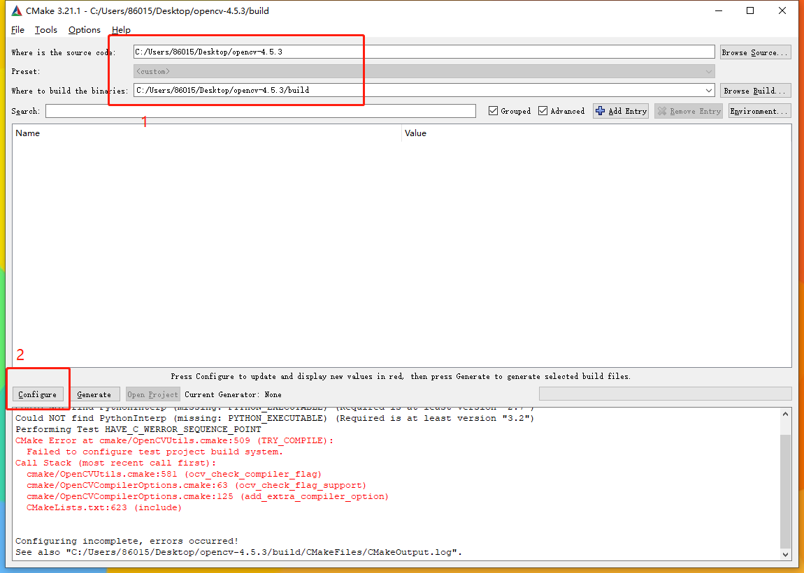
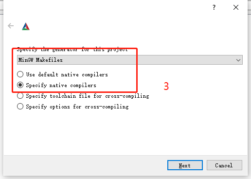
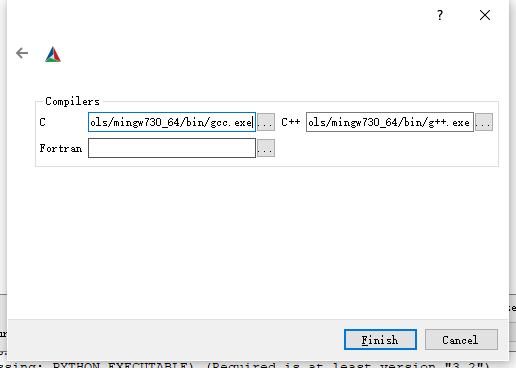
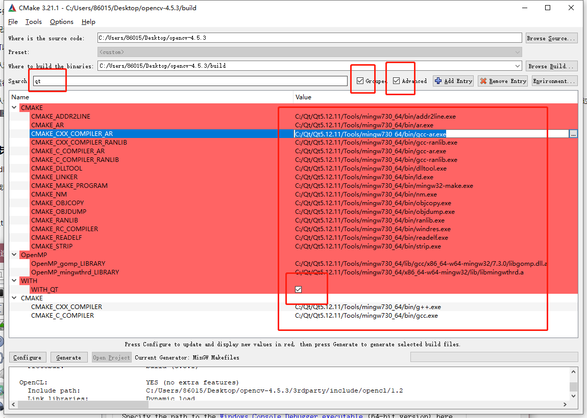

# OPENCV编译测试

## 1.Ubuntu编译

```
#wget https://github.com/opencv/opencv/archive/4.5.3.zip
#unzip opencv-4.5.3
#cd opencv-4.5.3
#sudo apt-get install cmake
#cmake -D CMAKE_BUILD_TYPE=RELEASE -D CMAKE_INSTALL_PREFIX=/usr/local -B ./build -D WITH_TBB=ON -D BUILD_NEW_PYTHON_SUPPORT=ON -D WITH_V4L=ON -D WITH_QT=ON -D WITH_OPENGL=ON
#cd ./build
#make
#make install

#vim /etc/ld.so.con
加入/usr/local/lib
#sudo ldconfig     #不执行这一步找不到链接库
```

## 2.windows编译QT版

所需工具cmake-gui

第一步



第二步 选择编译器






```
C:\Qt\Qt5.12.11\Tools\mingw730_64\bin\gcc.exe
C:\Qt\Qt5.12.11\Tools\mingw730_64\bin\g++.exe
```

第三步 确保配置项正确，同时勾选withQt选项



第四步 勾选WITH-QT ，再次Configure，同时确保各个QT配置之项正确，

注意：环境变量path中如果存在多余的编译器等，可能会出现问题。

第五步 Generate

第六步 用QT自带的编译环境执行make操作  mingw32-make.exe

## 3. 测试

