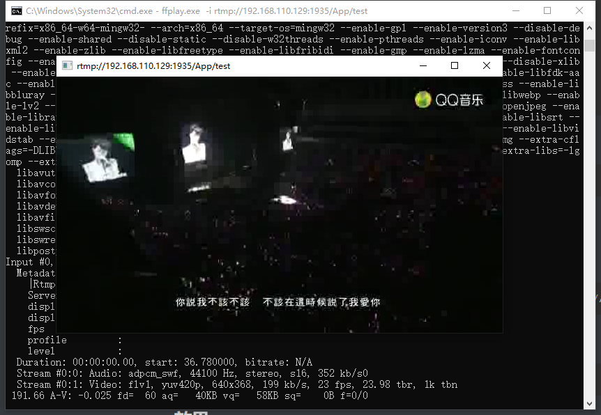

# RTMP服务器初体验

## 1. 运行环境

​	ubuntu20.04    nginx-1.20.1   nginx-rtmp-module  ffmpeg

## 2. 安装nginx

```shell
wget https://nginx.org/download/nginx-1.20.1.tar.gz
tar xvf nginx-1.20.1.tar.gz
wget https://github.com/arut/nginx-rtmp-module/archive/master.zip
unzip master.zip
./configure --prefix=/opt/nginx-1.20.1 --add-module=../nginx-rtmp-module-master --with-http_ssl_module
make
sudo make install
```

修改nginx 配置文件添加

```
cd /opt/nginx-1.20.1
sudo vim ./conf/nginx.conf
```

```
rtmp {  
    server {  
        listen 1935;      		 #监听的端口号
        application App {      #自定义的名字
            live on;  
       }  
        application hls {  
            live on;  
            hls on;  
            hls_path /tmp/hls;   
            hls_fragment 1s;
            hls_playlist_length 3s;  
       }  
    } 
}
```

启动nginx

```
sudo /opt/nginx-1.20.1/sbin/nginx -c /opt/nginx-1.20.1/conf/nginx.conf
```

查看启动情况，看到1935和80端口被监听

```
#sudo netstat -ntlp
Active Internet connections (only servers)
Proto Recv-Q Send-Q Local Address           Foreign Address         State       PID/Program name    
tcp        0      0 0.0.0.0:1935            0.0.0.0:*               LISTEN      8957/nginx: master  
tcp        0      0 0.0.0.0:80              0.0.0.0:*               LISTEN      8957/nginx: master  
tcp        0      0 127.0.0.53:53           0.0.0.0:*               LISTEN      642/systemd-resolve 
tcp        0      0 0.0.0.0:22              0.0.0.0:*               LISTEN      798/sshd: /usr/sbin 
tcp        0      0 127.0.0.1:631           0.0.0.0:*               LISTEN      2391/cupsd          
tcp6       0      0 :::22                   :::*                    LISTEN      798/sshd: /usr/sbin 
tcp6       0      0 ::1:631                 :::*                    LISTEN      2391/cupsd   
```

## 3.安装ffmpeg

ubuntu编译安装ffmpeg

```
git clone https://git.ffmpeg.org/ffmpeg.git ffmpeg
sudo apt-get install yasm -y		#安装依赖
cd ./ffmpeg
./configure --prefix=/usr/local/ffmpeg
make
sudo make install
```

windows编译好的下载链接  ffplay.exe

```
https://github.com/BtbN/FFmpeg-Builds/releases
```

## 4.测试

ubuntu推流

```
/usr/local/ffmpeg/bin/ffmpeg -re -i /home/book/Videos/mv.mp4  -f flv rtmp://192.168.110.129:1935/App/test
```

window端使用ffmpeg的ffplay.exe工具

```
ffplay.exe -i rtmp://192.168.110.129:1935/App/test
```

## 5.效果



